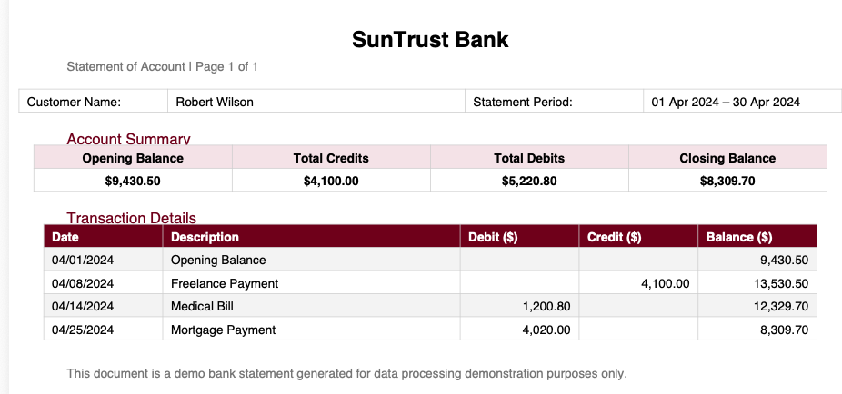
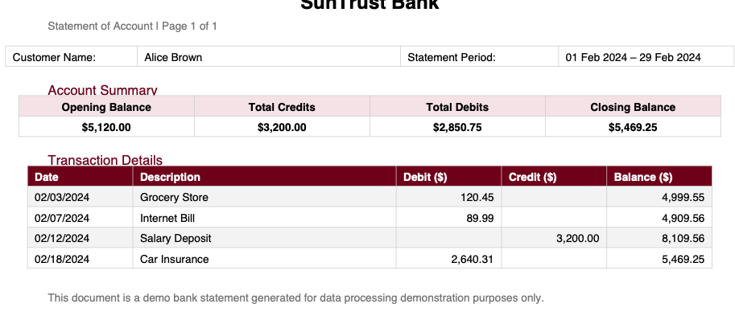
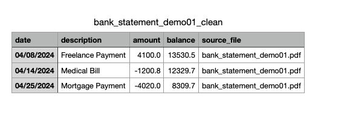
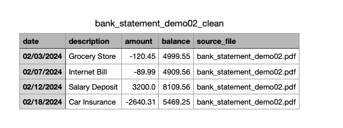

* # ✅ Demo 2 · Bank Statement Cleanup (PDF → Structured Table)

  **Bank Statement Normalization Demo**

  This project demonstrates a **production-style data cleaning pipeline** for converting **bank statement PDFs** into **clean, structured, analysis-ready tables**.

  It reflects real-world client scenarios on platforms like **Upwork**, where data often comes from:

  - bank statement PDFs
  - scanned or generated financial reports
  - semi-structured tables with balances and totals

  ------

  ## 🔴 The Problem (Before Cleaning)

  Raw bank statements are designed for **human reading**, not for systems or analysis.

  Typical issues include:

  - Transactions embedded in **PDF tables**
  - Separate **Debit / Credit columns**
  - Running **Balance column mixed with transactions**
  - Opening balance and summary rows mixed into data
  - No explicit sign convention (debit vs credit)
  - No machine-readable schema

  👉 Readable on screen, **painful to process programmatically**.

  ### 📌 Example (Raw PDF Input)

  

  

  *Shows debit/credit columns, running balance, and summary rows mixed with transactions.*

  ------

  ## 🟢 The Result (After Cleaning)

  Each bank statement is converted into a **clean transaction table** suitable for:

  - financial analysis
  - dashboards / BI tools
  - database import
  - accounting systems

  ### 📌 Example (Clean Output Table)

  

  

  ### ✅ What the pipeline guarantees

  - ✅ One row = one transaction
  - ✅ Debit / Credit normalized into a single numeric `amount` field
  - ✅ Expenses are negative, income is positive
  - ✅ Standardized date format (`YYYY-MM-DD`)
  - ✅ Clean running balance preserved
  - ✅ Source file traceability

  ------

  ## 📂 Input → Output Overview

  ### Input (Raw Files)

  ```
  data/raw/
  ├── bank_statement_demo01.pdf
  ├── bank_statement_demo02.pdf
  ├── bank_statement_demo03.pdf
  └── bank_statement_demo04.pdf
  ```

  - Files may differ slightly in layout
  - Raw files are **never modified**
  - Treated as source-of-truth

  ------

  ### Output (Clean Files)

  ```
  data/clean/
  ├── bank_statement_demo01_clean.csv
  ├── bank_statement_demo02_clean.csv
  ├── bank_statement_demo03_clean.csv
  └── bank_statement_demo04_clean.csv
  ```

  Each output file follows the same schema:

  | Column        | Description                     |
  | ------------- | ------------------------------- |
  | `date`        | Transaction date (YYYY-MM-DD)   |
  | `description` | Cleaned transaction description |
  | `amount`      | Signed numeric amount           |
  | `balance`     | Running account balance         |
  | `source_file` | Original PDF file name          |

  ------

  ## ⚙️ Cleaning Pipeline (How It Works)

  The pipeline is **rule-based, modular, and explainable**:

  1. Extract tabular data from PDF
  2. Remove non-transaction rows (headers, summaries)
  3. Normalize dates
  4. Merge Debit / Credit into a single amount
  5. Apply sign convention (credit + / debit −)
  6. Preserve running balance
  7. Enforce final schema
  8. Attach source file metadata

  Each rule is implemented as a **separate step**, not a monolithic script.

  ------

  ## 🧠 Design Decisions

  ### No Data Fabrication

  - Opening balance rows are excluded from transactions
  - Totals are not recalculated or inferred

  ### Financial Safety First

  - Debit and credit logic is explicit
  - Balance values are preserved exactly as provided

  ### Traceability

  - Original source file name is attached to every row
  - Intermediate extraction results are stored for inspection

  ### Batch-Oriented

  - All PDFs in `data/raw/` are processed automatically
  - No per-file manual handling

  ------

  ## 🏗 Project Structure

  ```
  bank-statement-cleanup-demo/
  ├── data/
  │   ├── raw/        # original PDF statements
  │   ├── interim/    # extracted tables
  │   └── clean/      # cleaned CSV outputs
  ├── src/
  │   ├── config.py
  │   ├── extract_tables.py
  │   ├── clean_rules.py
  │   └── run_pipeline.py
  ├── screenshots/    # before / after comparisons
  └── README.md
  ```

  ------

  ## ▶ How to Run

  ```bash
  python -m src.run_pipeline
  ```

  All PDF files in `data/raw/` are processed in batch, and cleaned results are written to `data/clean/`.

  ------

  ## 💼 Why This Demo Is Useful for Clients

  This demo shows that I can:

  - process **bank statements from PDFs**
  - normalize debit / credit into clean numeric data
  - preserve financial correctness
  - build **reusable batch pipelines**
  - explain every transformation clearly

  This same approach applies to:

  - personal bank statements
  - business account statements
  - credit card statements
  - financial compliance preprocessing

  ------

  ## 📌 Notes

  - This demo focuses on **data cleaning and normalization**, not financial advice.
  - The pipeline can be extended to support additional bank formats with minimal changes.
